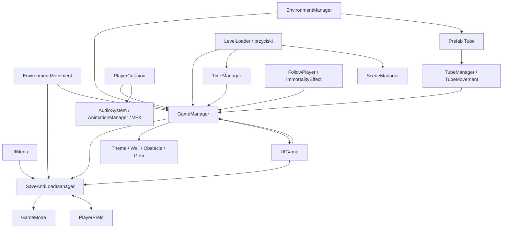
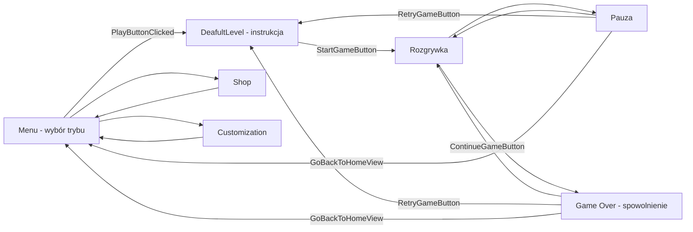

# Architektura Turbo Dash

Stan analizy: 2026-09-10, bazowy commit `5eb7e19` (`Initial Unity project`). Dokument opisuje zastane repozytorium. Wnioski o działaniu wynikają z kodu i serializacji; nie wykonano Play Mode ani builda.

## Geneza i granice interpretacji

Praca inżynierska Pawła Frąckowiaka „Projekt i implementacja gry mobilnej typu endless runner z wykorzystaniem sterowania żyroskopowego” (2024, dostarczony PDF, 60 stron) opisuje koncepcję tunelu i bonusów na s. 22–23, wymagania i scenariusze na s. 23–28, Unity 2022.3.4f1 na s. 34, strukturę na s. 40–50 oraz przesuwanie otoczenia i zarządzanie czasem na s. 51–52. Numery odnoszą się do stron PDF, zgodnych z widoczną numeracją tych rozdziałów. PDF pozostaje źródłem zewnętrznym; nie skopiowano go do repozytorium.

| Opis w pracy | Stan obecnego repozytorium |
| --- | --- |
| Nieruchomy gracz, otoczenie przesuwające się ku niemu, s. 51 | Potwierdzone: `TubeMovement`, obrót przez `EnvironmentMovement`, pozycja gracza przez `PlayerCollision` |
| `EnvironmentMovement` i centralny `GameManager`, s. 44–47 | Potwierdzone w kodzie i scenie gameplayowej |
| Diagram maszyny stanów, s. 28 | Jest opis projektowy; kod korzysta z kilku flag, nie z jednej klasy implementującej maszynę stanów |
| Rekord po przegranej, s. 22 | Ścieżka istnieje, ale warunki w `SaveHighScore` i `SaveHighSpeed` blokują zapis nowych rekordów do PlayerPrefs |
| Turbo przyspiesza gracza, s. 22 | Kod podwaja przyrost wyniku, zmienia FOV i efekty; nie zmienia bezpośrednio `tubeMoveSpeed` |
| Kontynuacja po reklamie, s. 26–27 | Jest przycisk natychmiastowej kontynuacji; nie znaleziono integracji reklam |
| Multiplayer i sklep jako dalszy rozwój, s. 54 | Istnieją wpis trybu i szkice scen, bez implementacji sieci/zakupów |
| Podpis `LevelGeneration`, s. 48 | Nie ma takiej klasy C#; bieżąca generacja jest rozłożona na `GameManager`, `EnvironmentManager`, `TubeManager` i dane |

Wymagań opisanych w PDF, takich jak ranking czy osiągnięcia, nie uznano za dowód ich implementacji. Cel przyszłej magisterki dotyczy sterowania agentem przez uczenie maszynowe. Repozytorium nie zawiera jeszcze agenta treningowego, obserwacji, nagród, definicji epizodu ani konfiguracji treningu.

## Organizacja repozytorium

`Assets/Turbo_Dash/` dzieli się na `Code`, `Design`, `Art` i `Addons`. To rzeczywisty podział opisany w pracy. `Design` zawiera sceny, prefaby i 19 własnych assetów ScriptableObject: 3 tryby, 2 motywy, 4 ściany, 3 przeszkody i 7 klejnotów. `Art` zawiera animacje, materiały, modele, dźwięki, tekstury oraz UI. Pozostałe zasoby obejmują TextMesh Pro, Sci-Fi UI, Heathen Engineering, Adaptive Performance i ustawienia Android/powiadomień.

W `Assets` są 97 plików C#: 30 własnego kodu, 67 importowanych skryptów i narzędzi. Pełne zestawienie każdego pliku i wszystkich 17 scen znajduje się w [inwentarzu](REPOSITORY_INVENTORY.md). Pakiety dostarczają dalszy kod, ale ich wygenerowana kopia `Library/PackageCache` nie jest kodem źródłowym repozytorium. Przeanalizowano manifest, lockfile i wykorzystane przez projekt zależności.

Nie ma własnych assembly definitions dla gameplayu, katalogu testów ani plików CI w repozytorium. Jedyny `.asmdef` w `Assets` należy do Heathen UX; nie zawiera pod sobą skryptów C#, a dwie jego zależności GUID są nierozwiązane. Runtime i skrypty przykładowe trafiają zasadniczo do domyślnego assembly, skrypty pod `Editor` do assembly edytorowego.

## Konfiguracja techniczna

| Obszar | Zastany stan i znaczenie |
| --- | --- |
| Unity | 2022.3.4f1, rewizja 35713cd46cd7 |
| Renderowanie | Built-in; `GraphicsSettings` i wszystkie poziomy `QualitySettings` nie wskazują SRP |
| Wejście | Legacy Input Manager, `UnityEngine.Input`, oś `Horizontal` w prototypowym `PlayerMovement`; aktywny ruch używa strzałek, dotyku i żyroskopu |
| Fizyka | 3D, `Fixed Timestep = 0.01` (100 kroków/s czasu gry), `Time.timeScale` zmieniany podczas pauzy i przegranej |
| Serializacja | Force Text; referencje po GUID + fileID, tagi w `TagManager.asset` |
| UI | uGUI, TextMesh Pro, `EventSystem` + `StandaloneInputModule`; zdarzenia przycisków zapisane w scenach |
| Android | min SDK 26, target 33, architektury 3 (ARMv7 + ARM64), backend 0 (Mono), wersja aplikacji 1.0.2 |
| Tożsamość aplikacji | `companyName: BoomBit`, `productName: Turbo_Dash`; są to wartości konfiguracji, nie ustalenie autora/właściciela |
| Pakiety używane bezpośrednio | TMP 3.0.6, uGUI 1.0.0, Post Processing 3.2.2; wiele własnych plików importuje `Unity.VisualScripting` 1.8.0 |
| Pakiety narzędziowe/mobile | Recorder 4.0.1, Timeline 1.7.4, Test Framework 1.1.33, IDE integrations, Device Simulator, feature.mobile 1.0.0, Adaptive Performance Samsung 5.0.0 |
| Lockfile | Rozwiązuje m.in. Adaptive Performance do 5.0.0, Notifications do 2.2.0, Android Logcat do 1.3.2; inna wersja żądana przez feature.mobile nie dowodzi konfliktu |

Brak pakietu Input System, ML-Agents, Netcode oraz biblioteki reklam/zakupów w manifeście. Obecność wbudowanego modułu AI nie jest dowodem używania AI w rozgrywce. `mainTemplate.gradle.DISABLED` pozostaje wyłączonym plikiem. Historyczne ustawienia kompilacji Android trzeba zweryfikować praktycznie.

## Klasy i odpowiedzialności

Wszystkie ścieżki poniżej są względne do `Assets/Turbo_Dash/Code/`. Gwiazdka oznacza klasę centralną dla podstawowego przepływu, a nie wymóg dodawania jej do każdej sceny.

| Plik / klasa | Odpowiedzialność i zależności |
| --- | --- |
| `Managers/GameManager.cs` * | Stan gry, wynik, poziomy, listy spawnów, motyw, życia, bonusy, rekord i restart. Zależy od `SaveAndLoadManager`, `AnimationManager`, `AudioSystem`, `UIGame`, danych i `SceneManager`. 511 linii. |
| `Managers/TimeManager.cs` * | Pauza/wznowienie i skala czasu; czyta/pisze `GameManager.gamePaused`. |
| `Managers/AnimationManager.cs` | Wyszukuje `CameraFollow`, ustawia triggery/bool animatora według kolizji i turbo. |
| `Managers/Managers.cs` | Deklaruje **klasę `Systems`**, singleton zachowujący obiekt rodzica managerów. |
| `Systems/Systems.cs` | Deklaruje **klasę `Managers`**, singleton zachowujący obiekt rodzica systemów. Nazwy plików i klas są zamienione. |
| `Systems/AudioSystem.cs` | Dwa AudioSource, muzyka menu/gry, SFX, przełączanie mute. |
| `Scripts/SaveAndLoadManager.cs` * | Wybrany `GameMode`, tablica trybów, zapis/odczyt rekordów PlayerPrefs. |
| `Scripts/EnvironmentMovement.cs` * | Odczyt sterowania i obrót otoczenia; zależy od wybranego trybu i stanu/lokacji `GameManager`. |
| `Scripts/EnvironmentManager.cs` * | Tworzy i usuwa tuby, zatrzymuje generowanie przed portalem, przebudowuje otoczenie po zmianie lokacji. |
| `Scripts/TubeManager.cs` * | Materiały tuby i losowanie jej zawartości z list `GameManager`; konsumuje licznik bezpiecznych tub. |
| `Scripts/TubeMovement.cs` * | Przesuwa tubę w osi -Z i usuwa po przekroczeniu dead zone. |
| `Scripts/PlayerCollision.cs` * | Stała pozycja gracza zależna od lokacji, kolizje, bonusy, utrata życia, przegrana, VFX/SFX i wibracje. |
| `Scripts/PlayerMovement.cs` | Inny model ruchu: Rigidbody + ruch Transform, upadek kończący grę. Nie znaleziono przypięcia do scen/prefabów. |
| `Scripts/FollowPlayer.cs` | Śledzenie lokalnej pozycji gracza; interpolacja FOV i offsetu przy turbo. |
| `Scripts/RandomArrangement.cs` | Losowy obrót prefabu wokół Z w krokach 45°. |
| `UIScripts/UIMenu.cs` * | Wyświetla rekord i wybrany tryb, zmienia tryb przez indeks tablicy, odczytuje rekordy na starcie menu. |
| `UIScripts/UIGame.cs` * | HUD i ekrany stanu, countdown kontynuacji, pop-upy, logika ładowania/zużycia turbo, pomiar prędkości wyniku, zapis HighSpeed. 331 linii. |
| `UIScripts/LoadLootPanel.cs` | Wyświetla globalne Coins/Diamonds odczytywane z PlayerPrefs. |
| `AnimationScripts/LevelLoader.cs` * | Publiczne metody przycisków, crossfade i ładowanie scen po indeksach; deleguje też start, pauzę, retry, continue i turbo. |
| `AnimationScripts/ObstacleMovement.cs` | Ruch sinusoidalny w dwóch osiach i obrót; sprawdza flagę pauzy. |
| `AnimationScripts/GemAnimationScript.cs` | Obrót, opcjonalny floating/scaling, przesunięcie klejnotu dla Outside; zależy od `GameManager`. |
| `AnimationScripts/ImmortalityEffect.cs` | Widoczność osłony i timer; **kończy również logiczną nieśmiertelność gracza**. |
| `AnimationScripts/DestroyParticleSystem.cs` | Kopiuje materiał rodzica, usuwa obiekt po `ParticleSystem.main.duration`; użyty w Explosion, dziedziczony przez warianty efektów zbierania. |
| `Shaders/BendControllerRadial.cs` | Globalne parametry i keywords shadera wyginającego świat; działa też w Edit Mode. |
| `Interfaceses/ISpawnable.cs` | Kontrakt indeksu, nazwy, prefabu, trudności i lokacji, zależny od enumów `GameManager`. |
| `ScriptableObjects/Wall.cs` | Konfiguracja ściany, implementacja `ISpawnable`. |
| `ScriptableObjects/Obstacle.cs` | Konfiguracja przeszkody, implementacja `ISpawnable`. |
| `ScriptableObjects/Gem.cs` | Konfiguracja klejnotu i upgradeLevel, implementacja `ISpawnable`. |
| `ScriptableObjects/Theme.cs` | Materiały gracza, ścian, przeszkód, tub, skyboxu i śladu. |
| `ScriptableObjects/GameMode.cs` | Indeks, opis, ikona, odblokowanie, rekordy i pola statystyk. Łączy konfigurację z mutowanymi danymi sesji. |

## Zależności i komunikacja

Nie ma własnej magistrali zdarzeń. Komunikacja to głównie `Instance`, publiczne pola, bezpośrednie wywołania i odpytywanie w `Update`. `GameManager` wyszukuje `UIGame` po tagu; `AnimationManager` wyszukuje `CameraFollow`. `UIGame` konsumuje flagi `showLevelUP` i pośrednio steruje zakończeniem turbo. Przyciski korzystają z serializowanych UnityEvent, więc sama analiza wywołań C# nie wystarcza do oceny użycia metod.

Życia i turbo oddziałują na rendering, audio, kamerę, UI i kolizje. Odwrotnie, `ImmortalityEffect` oraz `UIGame` modyfikują logikę gry. Wyłączenie wizualizacji na potrzeby przyszłego treningu mogłoby więc zmienić zasady gry.

## Sceny i inicjalizacja

| Scena | Indeks builda | Systemy zapisane w scenie i prefabach |
| --- | --- | --- |
| `Menu` | 0, start | `SaveAndLoadManager`, `AudioSystem`, `Managers` z `Systems.cs`, `UIMenu`, prefab `LootPanel` z `LoadLootPanel`, `LevelLoader`, TMP/uGUI/EventSystem |
| `DeafultLevel` | 1 | `GameManager`, `TimeManager`, `AnimationManager`, oba kontenery singletonów, `AudioSystem`, Environment*, PlayerCollision, ImmortalityEffect, FollowPlayer, UIGame, LevelLoader, PostProcessLayer/Volume i **dwa** BendControllerRadial; TubeManager/TubeMovement powstają z prefabów |
| `Shop` | 2 | TMP/uGUI/EventSystem, LevelLoader i LootPanel; powrót do menu; brak zakupów |
| `Customization` | 3 | TMP/uGUI/EventSystem, LevelLoader i LootPanel; powrót do menu; brak wdrożonej zmiany wyglądu |

`SampleScene` ma wyłączony wpis i nie istnieje w repozytorium. Pozostałe 13 scen to dema paczek, niewłączone do builda. Nie ma scen SkillTree i Leaderboard dla pól indeksów 4 i 5 w `LevelLoader`.

Diagram pokazuje zamierzony przepływ wywołań. Znane usterki opisuje audyt. Pierwszy start z menu tworzy system zapisu oraz audio. Po załadowaniu gameplayu `GameManager.Start` resetuje stan, dobiera listy, wybiera DefaultTheme i kalibruje żyroskop; `TimeManager.Start` ustawia skalę czasu i pauzuje grę. Obie metody `Start` nie mają skonfigurowanej wzajemnej kolejności. `EnvironmentManager.Start` tworzy pięć tub, a `TubeManager.Start` dobiera ich zawartość.

Kontener `----> Systems <----` jest korzeniem sceny i ma skrypt `Systems.cs` deklarujący `Managers`; jego dzieci to audio i, w menu, zapis. Kontener `----> Managers <----` w gameplayu ma `Managers.cs` deklarujący `Systems`; pod nim są GameManager, TimeManager i AnimationManager. Kontenery próbują zachować całe hierarchie przez `DontDestroyOnLoad`; dzieci także wywołują tę metodę na sobie. Unity dokumentuje jej działanie dla obiektów korzeniowych i zachowanie ich dzieci. Działanie dzieci zależy więc od zachowania kontenera, a nie od ich własnego wywołania. [Unity 2022.3: DontDestroyOnLoad](https://docs.unity3d.com/2022.3/Documentation/ScriptReference/Object.DontDestroyOnLoad.html).

To ważna zależność: `DeafultLevel` **nie zawiera `SaveAndLoadManager`**. Uruchomienie jej samodzielnie w nowej sesji pomija wymagany etap inicjalizacji. Trwałe managery z kolei mogą przeżyć powrót do menu, tracąc referencje do lokalnej kamery i UI. Nie ma obsługi `SceneManager.sceneLoaded`, która ponownie wiązałaby te referencje.

## Przepływ danych jednej rozgrywki

1. `UIMenu` wybiera asset trybu w `SaveAndLoadManager.usedGameMode`. Indeks 0 obsługuje żyroskop, 1 dotyk/strzałki. Indeks 2 nie ma implementacji ruchu.
2. `EnvironmentMovement.Update` oblicza `rotationAmount`, obraca rodzica tub i odwraca kierunek dla Outside. Gracz pozostaje na lokalnym Z=0; jego Y to -4 wewnątrz lub 6.5 na zewnątrz.
3. `TubeMovement.FixedUpdate` przesuwa segmenty według `tubeMoveSpeed`. `EnvironmentManager` dokłada segment długości 60 przy Z=240 i usuwa stare; restart otoczenia tworzy Z=0,60,120,180,240.
4. `TubeManager` zużywa początkowe trzy bezpieczne segmenty, potem tworzy ścianę albo przeszkodę i ewentualnie klejnot. `ISpawnable` pozwala użyć wspólnej funkcji generowania. Wszystkie 14 aktualnych assetów ścian/przeszkód/klejnotów ma trudność `Any`; filtr lokacji ma realne znaczenie, a filtr trudności na tych danych nie różnicuje list.
5. `GameManager.Update` nalicza wynik z czasu i poziomu. Progi zwykłych awansów zaczynają się od 1000/2000, zapowiedzi portali od 2800/3800; cykl powtarza się co 4000. Portal po kolizji koryguje wynik, zmienia Inside/Outside i podnosi poziom. Nie jest osobną sceną.
6. Kolizja przekazuje tag do `PlayerCollision`; ten wywołuje efekty `GameManager`, dźwięki, animację i VFX. Ostatnie życie prowadzi do `GameOver` i próby zapisu rekordu; skala czasu spada do 0.4.
7. `UIGame.Update` wybiera ekran na podstawie flag (kolejność: start, koniec, pauza, gra), aktualizuje HUD, liczy pochodną wyniku i obsługuje turbo oraz kontynuację. Waluty zapisuje bezpośrednio `GameManager`, rekordy `SaveAndLoadManager`.

Szczegółowe parametry i problemy poszczególnych systemów: [GAME_SYSTEMS.md](GAME_SYSTEMS.md). Przygotowanie do ML powinno zacząć się od stabilnego resetu, rozdzielenia sterowania od urządzenia oraz jednoznacznego pomiaru postępu; to propozycje przyszłych prac, nie istniejące elementy architektury.
