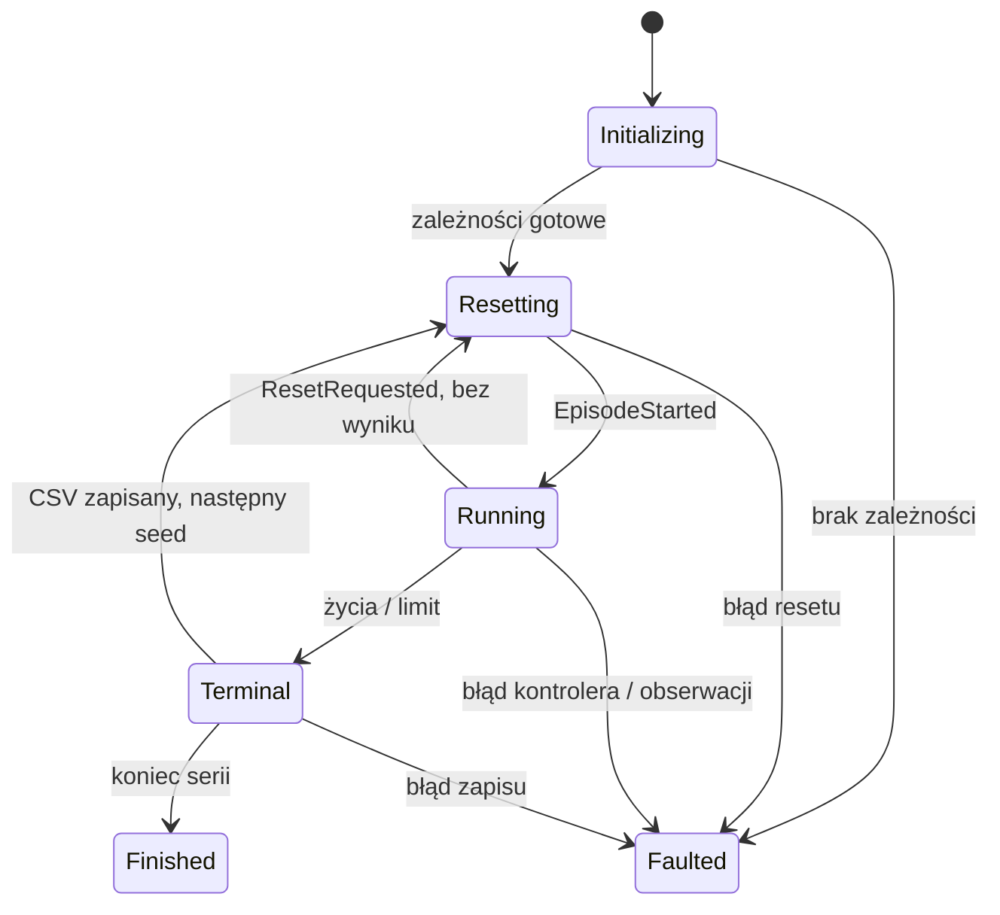

# Środowisko badawcze Turbo Dash

Implementacja dla Unity **2022.3.4f1**. Temat pracy: **„Opracowanie i analiza algorytmów uczenia maszynowego do sterowania agentem w grze typu endless runner.”** Wyniki przywrócenia wersji bazowej znajdują się w [BASELINE_VERIFICATION.md](BASELINE_VERIFICATION.md). Ten dokument opisuje architekturę przywróconego środowiska i zachowaną Observation v1. Aktualny, zamrożony kontrakt eksperymentów opisuje [RESEARCH_PROTOCOL_V1.md](RESEARCH_PROTOCOL_V1.md), a wykonany pilot [RULE_BASED_PILOT.md](RULE_BASED_PILOT.md); w punktach zmienionych przez protokół v1 te dwa dokumenty są nadrzędne.

Decyzje badawcze pozostają następujące: główne porównanie **Rule-based / PPO discrete / NEAT discrete**, dodatkowe **PPO discrete / PPO continuous**. NEAT continuous jest możliwy przez interfejs, ale nie jest wymaganym eksperymentem. Celem jest długoterminowy score przy zachowaniu trzech żyć. Nie dodano PPO, NEAT ani ML-Agents. Dodano niezależną od algorytmu specyfikację reward/fitness v1 oraz właściwy `RuleBasedV1`; `NoAction` pozostaje kontrolerem diagnostycznym.

## 1. Architektura ResearchMode

Nowy kod znajduje się w [Code/Research](../Assets/Turbo_Dash/Code/Research). Nie ma drugiej sceny gameplayu ani kopii mechanik. Badanie uruchamia istniejącą `DeafultLevel.unity`, jej prefaby i ScriptableObjects. Nie zmieniono scen, danych, pakietów, ProjectSettings ani istniejących GUID-ów.

| Element | Odpowiedzialność |
| --- | --- |
| `ResearchMode`, `ResearchOptions` | Bootstrap zależności, maszyna stanów epizodu, reset, limity i seria seedów |
| `IResearchController`, `SteeringAction` | Kontrakt decyzji niezależny od algorytmu |
| `HumanController` | Dotychczasowy odczyt strzałek, dotyku i żyroskopu |
| `EnvironmentMovement` | Wspólne zastosowanie obrotu, znak Inside/Outside; osobny harmonogram człowieka i badań |
| `ObservationProvider`, `CircularGeometry` | Numeryczny stan maksymalnie trzech tub, geometria zajętych kątów |
| `GameplayRandom` | Oddzielny generator pseudolosowy badania |
| `ResearchSegment` | Powiązanie wygenerowanego zagrożenia z tubą i liczenie napotkania/ominięcia |
| `ResearchEvents`, `EpisodeSummary` | Zdarzenia gameplayu, agregacja i CSV |
| `ResearchMenu` | Okno konfiguracji i wejście batch edytora |

`BeforeSceneLoad` tworzy runtime'owy `SaveAndLoadManager` oraz tymczasowy `GameMode` o indeksie 1. Nie korzysta z obiektu Menu ani z zapisywanego assetu trybu. Odczyty/zapisy rekordów w tym managerze są pomijane w badaniu. W `GameManager` monety i diamenty zaczynają od zera i nie zapisują PlayerPrefs. Bezpośredni start ujawnił dodatkowo pustą, zbyt wcześnie zapamiętaną referencję `audioSystem`; teraz getter pobiera aktualną instancję. Audio i pozostałe usługi nadal pochodzą z właściwej sceny. Kolejność inicjalizacji opiera się na [API RuntimeInitializeOnLoadMethod](https://docs.unity3d.com/2022.3/Documentation/ScriptReference/RuntimeInitializeOnLoadMethodAttribute.html).

Uruchomienie w edytorze: **Turbo Dash → Research → Configure and run → Start research episodes**. Okno otwiera bezpośrednio `DeafultLevel` i włącza Play Mode. Ustawienia w SessionState są usuwane po wyjściu z Play Mode. Zwykła gra nadal startuje od `Menu.unity`.

Domyślne **3 epizody po maksymalnie 300 sekund**, seed początkowy 12345 i `maxScore = 0` są zgodne z limitami protokołu v1; do właściwych eksperymentów należy podać jawny zestaw seedów. `maxScore = 0` / `maxDuration = 0` wyłącza dany limit; `episodeCount = 0` oznacza serię bez ograniczenia liczby, chyba że podano skończoną tablicę seedów. Można podać własny CSV; pusta ścieżka tworzy unikalny plik w `Application.persistentDataPath/Research`. Istniejący niepusty plik jest odrzucany, aby nie mieszać sesji i identyfikatorów epizodów.

Przykład konfiguracji **diagnostycznej**, nie zbioru treningowego/ewaluacyjnego:

```json
{
  "initialSeed": 12345,
  "episodeCount": 3,
  "seeds": [101, 202, 303],
  "maxDuration": 10,
  "maxScore": 0,
  "autoAdvance": true,
  "csvPath": "D:/ResearchRuns/turbo-dash-smoke.csv"
}
```

Wejście batch: `-batchmode -projectPath <projekt> -executeMethod TurboDash.Research.Editor.ResearchMenu.RunBatch -turboResearchConfig <plik.json> -logFile <log>`. Nie dodawaj `-quit`: wejście przechodzi do Play Mode, a launcher kończy proces po serii lub błędzie. Uruchamiaj osobną kopię, jeżeli projekt jest już otwarty. Format argumentów opisuje [dokumentacja edytora Unity](https://docs.unity3d.com/2022.3/Documentation/Manual/EditorCommandLineArguments.html). To wejście **edytora**; nie przygotowano jeszcze dedykowanego standalone playera badawczego. Samo przekazanie konfiguracji normalnemu buildowi zaczynającemu od Menu nie zastępuje tego launchera.

## 2. Episode lifecycle



`LateUpdate` zbiera stan po gameplayu i kolizjach; dopiero potem rozstrzyga terminal i zapisuje jeden wiersz. Dzięki temu śmiertelne trafienie trafia do podsumowania przed resetem. Kolejność warunków: `LivesExhausted`, `MaxScore`, `MaxDuration`. Limity sprawdzane na granicy klatki mogą być przekroczone o przyrost ostatniej klatki; nie są bezwzględnym clampem wyniku/czasu.

Wywołanie `ResetEpisode(seed)` podczas gry anuluje bieżącą próbę i kolejkuje reset na bezpiecznej granicy klatki. `ResetRequested` nie emituje poprawnego terminalu, nie wywołuje `EpisodeCompleted` i nie zapisuje wiersza CSV. Reset w trakcie innego resetu jest odrzucany. Po ostatnim epizodzie gra jest zatrzymana w `Finished`; można uruchomić następny przez API. Błąd przechodzi w `Faulted`, zatrzymuje czas i dalsze epizody; nie jest etykietowany jako poprawny wynik agenta.

## 3. ResetEpisode

Reset trwa przez dwie pauzowane granice klatek i nie ładuje sceny. Unity usuwa obiekty przez odroczone `Destroy`; najpierw wyłączane są stare tuby i efekty, następnie następuje klatka na ich usunięcie, a dopiero potem generowanie następców. Druga pauzowana klatka umożliwia `Start` nowych animacji/bonusów przed `EpisodeStarted`.

| Stan | Operacja resetu |
| --- | --- |
| Wynik, progi, poziom i lokacja | `GameManager.StartGame()`: score/timer 0, level 1, Inside, progi 1000/2000/2800/3800 |
| Życia i waluty | 3/3 życia; monety i diamenty 0 w pamięci |
| Shield / immortality / turbo | Flagi false, renderery osłon wyłączone, timer `ImmortalityEffect` wyzerowany |
| Charge i UI | `UIGame.ResetEpisodeUI()`: slider 0, liczniki, rekord/popup flags i wszystkie coroutine od nowa |
| Ruch | Prędkość 50, extra 0, obrót świata z początku sesji, ostatnia komenda/rotationAmount 0, Rigidbody gracza zatrzymany |
| Generator | Timer i blokada 0, lokacja zsynchronizowana, pięć nowych tub, trzy początkowe bezpieczne tuby |
| RNG i faza ruchu | Nowy seed, licznik tub 0, fizyczny zegar epizodu 0 |
| Coroutine / Invoke | Zatrzymane w managerze gry, UI, loaderach i resetowanych komponentach; efekty poprzedniego epizodu zniszczone |
| Kamera / VFX / audio | FOV/offset początkowy, animator kamery Rebind, wyczyszczone trail renderery, dźwięki zatrzymane i muzyka uruchomiona ponownie |
| Czas | Podczas resetu 0; na starcie `TimeManager.ResetTimeScale()`, timeScale 1, `gameStart=false`, `gamePaused=false` |
| Metryki / kontroler | Nowy `EpisodeSummary`; `Controller.ResetEpisode(seed)` |

Po wygenerowaniu pięciu tub `safeTubes` wynosi **0**: trzy bezpieczne zostały już zużyte, a dwie dalsze mają normalną zawartość. To poprawny stan generatora, nie utrata ustawienia trzech bezpiecznych segmentów.

Singletony `GameManager`, `TimeManager`, `AnimationManager`, `AudioSystem` i historyczne kontenery `Managers`/`Systems` pozostają w tej samej sesji. Reset nie dokłada kolejnych ich instancji. Usługa zapisu ma jeden tymczasowy tryb, a subskrypcje zdarzeń sesji pozostają aktywne pomiędzy epizodami; są czyszczone przy starcie/zakończeniu runtime. Subskrybenci odpowiadają za reset własnego stanu w `ResetEpisode`/`EpisodeStarted`. Zaobserwowane stabilne liczby obiektów po kolejnych resetach nie zastępują długiego profilowania pamięci.

## 4. Controller abstraction

`IResearchController` udostępnia `ControllerType`, `ActionSpaceType`, `ResetEpisode(int seed)` i `Decide(ObservationFrame)`. `SetController` jest dozwolone pomiędzy epizodami. Nazwa i przestrzeń są walidowane oraz zapisywane w CSV. `NoActionController` zwraca NONE. `SubmittedActionController` przyjmuje komendę z zewnętrznego adaptera, utrzymuje ją do następnej i zeruje przy resecie. Właściwe RuleBased/PPO/NEAT mogą implementować ten sam interfejs.

Badanie obraca świat w `EnvironmentMovement.FixedUpdate`, przed zwykłymi komponentami ruchu i symulacją fizyki, z istniejącym krokiem **0,01 s = 100 Hz czasu gry**. `DecisionScheduler` pobiera Observation v2 i wywołuje kontroler co pięć kroków, czyli **20 Hz**, począwszy od pierwszego aktywnego kroku; pomiędzy decyzjami utrzymuje ostatnią akcję. Normalne sterowanie człowieka pozostaje w `Update`; oba źródła ostatecznie używają `ApplyDegreesPerSecond`. Fizyka zachowuje oryginalny Fixed Timestep; [Unity definiuje go w czasie gry](https://docs.unity3d.com/2022.3/Documentation/ScriptReference/Time-fixedDeltaTime.html).

Odczyt klawiatury/dotyku/gyro przeniesiono do `HumanController`; nieaktywny `PlayerMovement` pozostaje niewykorzystywany. Skróty debugowe wyniku, bonusów i pauzy są pomijane w ResearchMode. Człowiek nadal ręcznie aktywuje turbo, natomiast badanie aktywuje je automatycznie po pełnym naładowaniu.

## 5. Discrete action space

| Wartość enum | Akcja | Steering | Obrót świata Inside | Obrót świata Outside |
| --- | --- | --- | --- | --- |
| 0 | LEFT | +1 | dodatni Z | ujemny Z |
| 1 | NONE | 0 | 0 | 0 |
| 2 | RIGHT | -1 | ujemny Z | dodatni Z |

LEFT/RIGHT są z perspektywy gracza. Kontroler nie odwraca znaku dla Outside. Prędkość maksymalna badania to `rotationSpeed²`, czyli przy zapisanym 12 **144°/s**, taka sama jak ludzkie strzałki/dotyk. Kontroler oznaczony jako discrete nie może zwrócić wartości pośredniej; środowisko zgłasza błąd zamiast błędnie podpisywać taki eksperyment.

## 6. Continuous action space

`SteeringAction(float)` przyjmuje steering w `[-1,1]`: wartości skończone są przycinane, NaN/Infinity odrzucane. Prędkość wynosi `steering × 144°/s`; ±1 odpowiada dokładnie LEFT/RIGHT, a np. +0,5 daje 72°/s w kierunku LEFT. NONE odpowiada 0. Sterowanie nie jest teleportacją na tor ani zadaniem kąta docelowego.

Historyczny żyroskop człowieka zachowuje `Clamp(q.z × Rad2Deg, ±maxRotationSpeed) × rotationSpeed`, czyli maksymalnie 264°/s dla 22 i 12. Nie przycięto go do 144°/s, aby zachować normalną grę. **Porównania agentów** discrete/continuous mają wspólny limit 144°/s; gyro nie jest jedną z porównywanych polityk.

## 7. Observation v1 — diagnostic reference

Aktywną obserwacją kontrolerów jest obecnie Observation v2 opisana indeks po indeksie w [RESEARCH_PROTOCOL_V1.md](RESEARCH_PROTOCOL_V1.md). Zachowany `ObservationFrameV1.SchemaVersion = 1` i `ObservationProviderV1` udostępniają diagnostyczny wektor **2633 floatów**:

`8 + 3 × (3 + 32 × 16 + 40 × 9)`.

Każda tuba ma 3 pola nagłówka, 32 sloty zakresów zagrożeń i 40 slotów pojedynczych bonusów. 40 jest potrzebne dla obecnego `Gold 3`. Nadmiar powoduje jawny błąd wymagający rewizji schematu; dane nie są po cichu obcinane. Brak tuby/slotu daje same zera; maska `exists` rozróżnia brak od zerowej odległości. Kolejność tub: położenie Z, potem kolejny numer generacji. Sloty wewnątrz tuby mają stabilną kolejność hierarchii prefabów, nie sortowanie po InstanceID.

Wybierane są najwyżej trzy najbliższe tuby, których tylna krawędź (`root.z + tubeLength/2`) jeszcze nie minęła gracza. Bieżąca częściowo minięta tuba może być pierwsza. Collidery całkowicie za graczem są pomijane. Nie ujawnia się kolejnych losowań generatora.

### Pola globalne: indeksy 0–7

| Indeks / pole | Źródło | Jednostka i surowy zakres | Normalizacja / zakres wektora |
| --- | --- | --- | --- |
| 0 lives | `GameManager.playerLives`, `maxPlayerLives` | liczba 0–3 | lives/max, 0–1 |
| 1 hasShield | `playerShield` | bool | 0/1 |
| 2 boostCharge | `UIGame.turboSlider.value` | ułamek 0–1 | bez zmiany |
| 3 boostActive | `turboEffectEnable` | bool | 0/1 |
| 4 temporaryProtection | `playerImmortality` | bool | 0/1; turbo osobno |
| 5 environmentSpeed | `tubeMoveSpeed` | jednostki Unity/s, obecnie 50–80 | speed/(50+speed), obecnie 0,5–0,6154 |
| 6 isOutside | `gameLocation` | Inside/Outside | 0/1 |
| 7 level | `gameLevel` | całkowita wartość float ≥1 | level/(1+level), [0,5;1) |

### Nagłówek tuby: offset `8 + tubeIndex × 875`

| Offset | Źródło | Jednostka / zakres | Normalizacja |
| --- | --- | --- | --- |
| 0 exists | żywy `ResearchSegment` | bool | 0/1 |
| 1 distance | `root.z − tubeLength/2 − player.z` | jednostki Unity; może być ujemne dla bieżącej tuby | Clamp01(distance/240) |
| 2 hasPortal | aktywny collider z tagiem Portal, jeszcze przed/na graczu | bool | 0/1 |

### Slot zagrożenia: offset `tube + 3 + hazardIndex × 16`

| Offset / pole | Źródło | Jednostka / surowy zakres | Normalizacja / zakres |
| --- | --- | --- | --- |
| 0 exists | collider/spójny zakres zajętości | bool | 0/1 |
| 1 wall | tag Wall | bool | 0/1 |
| 2 obstacle | tag Obstacle | bool | 0/1 |
| 3 sinAngle | środek zajętego zakresu, kąt gracza i lokacja | kąt w radianach, kołowy | sin, [-1,1] |
| 4 cosAngle | jak wyżej | jak wyżej | cos, [-1,1] |
| 5 angularWidth | `CircularGeometry.Spans` | radiany [0,2π] | width/(2π), [0,1] |
| 6 distance | `collider.bounds.min.z − player.z` | jednostki Unity | Clamp01(distance/240) |
| 7 moving | flagi `ObstacleMovement` | bool | 0/1 |
| 8 localVelocityX | cos(t×speedSide)×speedSide×rangeSide, gdy side-to-side | lokalne jednostki Unity/s, wartość ze znakiem | v/(1+abs(v)), (-1,1) |
| 9 localVelocityY | analogicznie dla up/down | lokalne jednostki Unity/s | jak wyżej |
| 10 angularSpeed | `ObstacleMovement.rotationSpeed`, gdy obrót aktywny | stopnie/s wokół skonfigurowanej osi lokalnej | u/(1+abs(u)), u=speed/360 |
| 11 sidePhaseSin | `GameplayTime × movementSpeedSide` | radiany | sin; 0 przy wyłączonym ruchu |
| 12 sidePhaseCos | jak wyżej | radiany | cos; 0 przy wyłączonym ruchu |
| 13 upPhaseSin | `GameplayTime × movementSpeedUpDown` | radiany | sin; 0 przy wyłączonym ruchu |
| 14 upPhaseCos | jak wyżej | radiany | cos; 0 przy wyłączonym ruchu |
| 15 approximateGeometry | rodzaj/orientacja collidera | bool | 0/1 |

Względny kąt wynosi `(kąt świata − atan2(player.y, player.x)) × znakLokacji`, gdzie znak to +1 Inside i −1 Outside. Jego sin/cos nie ma przerwy na 0/360. Dodatnia komenda LEFT zwiększa tak zdefiniowany kąt obiektu w obu lokacjach.

Geometria korzysta z promienia aktualnej orbity gracza: 4 Inside, 6,5 Outside. Dla BoxCollider wylicza przecięcia okręgu z płaszczyznami ścian pudełka; potrafi zwrócić kilka rozłącznych przedziałów. Przykładowo słup przecinający środek tunelu zajmuje dwa wąskie zakresy, a nie jeden pełny okrąg. Przedziały są łączone na granicy 0/360. SphereCollider ma przecięcie analityczne. Dla mesh/capsule stosowany jest zaznaczony w obserwacji world AABB. Przekrój pudełka nachylonego poza XY też jest oznaczony jako przybliżenie.

To przekrój na głębokości środka collidera i orbita **środka gracza**, nie dokładna prognoza bryłowej kolizji całego gracza. Nie uwzględnia marginesu jego szerokości ani pełnej przyszłej obwiedni ruchu. Collider chwilowo poza orbitą pozostaje reprezentowany przez środek i width=0, aby ruchome zagrożenie nie znikało z danych. Kilka colliderów jednej piły może dawać nakładające się zakresy; należy interpretować ich sumę. Tych przybliżeń nie wolno mylić z gwarancją bezpiecznej trasy. Obserwacje nie używają kamery, obrazu ani raycastów.

### Slot bonusu: offset `tube + 3 + 32 × 16 + bonusIndex × 9`

| Offset / pole | Źródło | Jednostka / zakres | Normalizacja |
| --- | --- | --- | --- |
| 0 exists | aktywny collider bonusu | bool | 0/1 |
| 1–5 typ | tagi kolejno Heart, Shield, Boost, Gold, Diamond | kategoria | pięć osobnych pól one-hot, każde 0/1 |
| 6 sinAngle | XY środka `collider.bounds`, pozycja gracza i lokacja | kąt kołowy | sin, [-1,1] |
| 7 cosAngle | jak wyżej | kąt kołowy | cos, [-1,1] |
| 8 distance | `collider.bounds.min.z − player.z` | jednostki Unity | Clamp01(distance/240) |

Normalizacje są stałe, nie dopasowywane do wyników zbioru testowego. Pola motion opisują aktualne parametry/fazę; nie stanowią kompletnego modelu dynamiki. Schemat i ewentualne późniejsze zmiany liczby slotów trzeba wersjonować razem z politykami.

## 8. RNG i seedy

Wszystkie aktywne losowania generatora przechodzą przez `GameplayRandom.Range`. Tryb ludzki zachowuje `UnityEngine.Random.Range`; ResearchMode używa własnego xorshift32 z rejection sampling. Nie wywołuje `UnityEngine.Random.InitState` na potrzeby generatora. `TubeManager.Initialize` i `RandomArrangement.Initialize` są idempotentne; badanie inicjalizuje je synchronicznie w kolejności spawnu, więc późniejsze `Start` nie zużywa RNG drugi raz.

| Miejsce | Losowanie i zachowany skutek |
| --- | --- |
| `GameManager.SpawnObject` | indeks [0,count), równomierny wybór dostępnego assetu |
| `TubeManager` | int [1,100): kategoria Obstacle przy wyniku ≤30/40/50/60, w przeciwnym razie Wall |
| `TubeManager` | int [1,3): bonus gdy 1, czyli **50%** |
| `RandomArrangement` | int [0,7) ×45°: **0–270°**, siedem pozycji; 315° nie jest losowane |

Pozostałe `Random` w przykładach addonów dotyczą m.in. kolorów, UI i efektów; nie kierują aktywnym generatorem. Nie poprawiono błędnych komentarzy sugerujących 33% ani nie dodano ósmego kąta, ponieważ zmieniłoby to balans. Gracz nadal może obracać się przez pełne 360°.

`ResetEpisode(seed)` odtwarza początkową planszę i ciąg losowań gameplayu. Test porównuje zawartość i ustawienia 35 tub, również po 2190 dodatkowych losowaniach Unity RNG. Ruch sinusoidalny korzysta w badaniu z zerowanego zegara fizycznego epizodu; normalna gra zachowuje `Time.time`.

Seed nie oznacza identycznego całego przebiegu przy dowolnych akcjach. Bonusy/turbo wpływają na score i moment zmian poziomu, a poziom/lokacja wpływają na generowanie. Powtarzalność dalszej planszy wymaga tego samego stanu i sekwencji wywołań generatora. Pełna trajektoria fizyki i animowanych colliderów nie ma jeszcze gwarancji identyczności bitowej między maszynami/FPS. Wspólne seedy zapewniają wspólną losowość początkową, nie usuwają konsekwencji różnych działań.

Domyślny harmonogram awaryjny to `initialSeed + episodeIndex ×104729` w arytmetyce int32. Jest oddzielony od losowań treści. Protokół v1 przechowuje jednak jawne, rozłączne zbiory TRAIN 700, VALIDATION 100 i TEST 200 w `Assets/Turbo_Dash/Research/Seeds`. `ResearchSeedCatalog` waliduje ich rozmiar, dodatniość i globalną unikalność. TEST pozostaje zamrożony i nieużyty w pilocie.

## 9. Metryki i wspólne zdarzenia

CSV jest UTF-8, separator przecinek, liczby z kropką niezależnie od polskich ustawień, tekst prawidłowo cytowany. Jeden wiersz przypada na **zakończony** epizod. Błąd procesu, przerwanie Play Mode lub `Faulted` nie tworzy udawanego poprawnego terminalu. `episodeId` jest kolejny w obrębie nowej sesji/pliku.

| Pola CSV | Definicja / jednostka |
| --- | --- |
| episodeId, controllerType, actionSpaceType, seed | Numer od 1, nazwa kontrolera, Discrete/Continuous, seed int32 |
| finalScore | `GameManager.gameScore`, umowne punkty postępu |
| survivalTime | Suma kroków fizyki po 0,01 s aktywnego epizodu; sekundy gry, bez resetów |
| segmentsPassed | Tylna krawędź tuby minęła płaszczyznę gracza; jeden raz na tubę, także bezpieczną |
| obstaclesEncountered | Logiczny spawn Wall/Obstacle dotarł przednią krawędzią do płaszczyzny gracza albo doszło do kontaktu; jeden raz na spawn |
| obstaclesAvoided | Wszystkie pozostałe collidery tego spawnu minęły gracza i nie było kontaktu |
| collisionsTotal | Liczba `OnTriggerEnter` z Wall/Obstacle, także podczas ochrony; może obejmować kilka colliderów jednego spawnu |
| lifeLossCount | Faktyczne utraty życia, także ostatniego; może przekroczyć 3 po zbieraniu Heart |
| shieldHits | Zużycia aktywnej tarczy przez trafienie; nie każde trafienie podczas immortality |
| fatalCollision | Ostatnie życie zostało utracone przez obsługę kolizji |
| heartsCollected, shieldsCollected, boostsCollected | Liczba kontaktów/pobrań odpowiednich bonusów; Heart liczy się także przy pełnym zdrowiu |
| goldCollected, diamondsCollected | Pojedyncze zebrane collidery monet/diamentów, nie całe prefabowe zestawy |
| maxLevel | Największy osiągnięty poziom |
| outsideStagesReached | Liczba wejść Inside→Outside |
| timeInside, timeOutside | Sekundy gry przypisane lokacji na końcu klatki; suma równa survivalTime z błędem float |
| maxEnvironmentSpeed | Maksymalne `tubeMoveSpeed`, jednostki Unity/s; nie prędkość punktów/s z HUD |
| terminalReason | LivesExhausted / MaxScore / MaxDuration; ResetRequested nie tworzy wiersza |
| trainingRunId, trainingStep, generation, trainingTime | Zarezerwowane dla przyszłego adaptera |
| episodeReward, fitness | Wypełniane przez aktywny kalkulator pilot reward/fitness v1 |

Ściana z czterema colliderami jest jednym logicznym spawnem dla encountered/avoided. `collisionsTotal` liczy kontakty fizyczne, więc jego mianownik jest inny. Obiektu skasowanego przed spotkaniem przez zmianę lokacji/reset nie liczy się jako ominiętego. Obiekt tylko wygenerowany daleko przed graczem nie zwiększa encountered. Trafienie pod tarczą/turbo jest kontaktem i nie jest „uniknięciem”, nawet bez straty życia. Scenariusze debugowe w testach nie stanowią wyników polityki.

`ResearchEvents.Raised` przekazuje `ScoreDelta`, `Collision`, `LifeLost`, `ShieldConsumed`, `HeartCollected`, `ShieldCollected`, `BoostCollected`, `TurboActivated`, `GoldCollected`, `DiamondCollected`, `Terminal`. `Value` to delta score lub liczność zdarzenia; terminal ma też reason. Zdarzenia bonusów pochodzą z obsługi kolizji, a `TurboActivated` z rzeczywistego przejścia nieaktywne→aktywne. Kalkulator v1 bezpośrednio uwzględnia wyłącznie score i utratę życia. Główną wartość Heart/Shield/Boost ma stanowić przyszłe przeżycie i score.

## 10. Score — dokładny wzór

Źródło: `GameManager.Update`, `FixScore`, `PlayerCollision.OnTriggerEnter`. Pozostawiono dotychczasowy wzór:

```text
multiplier(level) = (level + 10) / 10
timer_next = timer + deltaTime × 23 × multiplier(level) × (turbo ? 2 : 1)
gameScore = timer
```

Przy level 1 daje to 25,3 punktu/s, a z turbo 50,6. `deltaTime` jest skalowane przez Unity; przy pauzie 0. Poziom użyty do naliczenia punktów jest poziomem przed późniejszymi testami progów w danym `Update`. Naliczanie jest wyłączone po `gameHasEnded`. Badanie dodatkowo pomija aktualizację managera poza aktywnym epizodem, aby reset/podsumowanie nie były naliczane jako rozgrywka.

`FixScore` wybiera wcześniejszy z progów `thirdLevelUP`/`fourthLevelUP`, wykonuje `timer = max(timer, threshold + distanceToSpawnPortal)` i przesuwa ten próg o 4000. Przykładowo portal zamówiony po 2800 dociąga timer co najmniej do 3000. Samo `gameScore` jest aktualizowane dopiero w następnym `Update`. Delta score obejmuje ten skok. Fizyczny kontakt z portalem zeruje flagę zamówienia, wykonuje FixScore, zmienia lokację i podnosi level.

Score nie jest całką prędkości tub ani rzeczywistym dystansem w metrach. Turbo podwaja punktowanie, lecz samo nie podwaja `tubeMoveSpeed`. HUD oblicza pochodną score i oznacza ją m/s; metryka badania `maxEnvironmentSpeed` celowo czyta prędkość świata. Nie zmieniono ani tych zależności, ani dopasowania wyniku przy portalach.

## 11. Difficulty / level cycle

Progi są sprawdzane przez **`>`**, nie `>=`. Pierwszy/drugi level-up początkowo wypada po 1000/2000; po użyciu dany próg rośnie o 4000. Portale są zamawiane po 2800/3800, następnie 6800/7800 itd. Wejście w nową lokację następuje dopiero przy kontakcie z wygenerowanym portalem, dlatego granice score nie są idealnie sztywnymi przedziałami.

| Level | Typowy początek score / lokacja | Difficulty bieżącej lokacji | tubeMoveSpeed |
| --- | --- | --- | --- |
| 1 | 0 / Inside | Easy | 50 |
| 2 | >1000 / Inside | Medium | 55 |
| 3 | >2000 / Inside | Hard | 60 |
| 4 | portal ≥3000 / Outside | Easy | 65 |
| 5 | portal ≥4000 / Inside | Easy | 70 |
| 6 | >5000 / Inside | Medium | 75 |
| 7 | >6000 / Inside | Hard | 80 |
| 8 | portal ≥7000 / Outside | Medium | 80 |
| 9 | portal ≥8000 / Inside | Easy | 80 |
| 10 | >9000 / Inside | Medium | 80 |
| 11 | >10000 / Inside | Hard | 80 |
| 12 | portal ≥11000 / Outside | Hard | 80 |
| 13–15 | od ≥12000 / Inside | Easy→Medium→Hard | 80 |
| 16 | portal ≥15000 / Outside | Easy | 80 |

**Rozbieżność z zamysłem dalszego przyspieszania:** `extraMoveSpeed` rośnie po 5 tylko do 30, więc od level 7 prędkość wynosi 80, także po level 12. Zawartość nie ma dwunastu osobnych zestawów. Są 4 Wall, 3 Obstacle i 7 Gem, wszystkie z difficulty Any; filtrowane są również lokacją. Filtr w `UpdateObjectListToSpawnByLevel` używa zawsze `gameInsideDifficulty`, również na Outside. Obecne Any maskuje tę usterkę; przed dodaniem danych o różnej trudności potrzebna będzie osobna decyzja/poprawka.

Parametr kategorii Obstacle wynosi 30 dla level 1–2, 40 dla 3–4, 50 dla 5–6, 60 od 7. Ponieważ losowanie jest [1,100), faktyczne prawdopodobieństwa wynoszą **30/99, 40/99, 50/99, 60/99**. Gałąź przeciwna wybiera Wall, więc nie oznacza to procentu wszystkich niebezpiecznych tub. Bonus jest losowany niezależnie z prawdopodobieństwem 1/2; jego asset jest wybierany równomiernie z dostępnej listy, a rozmiar grup monet zależy od prefabu.

Generator zachowuje `tubeSpawnRate = 60/speed`, warunek timera `>= tubeSpawnRate − 0,01`, pięć tub początkowych i blokowanie dalszego spawnu po wysłaniu tuby portalu. Przy zmianie lokacji tworzy ponownie pięć tub, z których dwie są bezpieczne. Nie zmieniono prawdopodobieństw ani niezależnego, ryzykownego ustawienia bonusów. Nie gwarantuje się bezkolizyjnego przejścia ani możliwości naprawienia dowolnej wcześniejszej decyzji.

## 12. Inside / Outside

Gracz pozostaje w `PlayerCollision` na lokalnym `(0,-4,0)` Inside i `(0,6.5,0)` Outside. Świat przesuwa się w -Z i obraca wokół Z. Znak obrotu odwraca `EnvironmentMovement`; obserwacja uwzględnia to samo odniesienie gracza. `GemAnimationScript.Start` zachowuje przesunięcie bonusów o +10 w lokalnym Y dla Outside. Sposób doboru materiałów i sekwencja trudności pozostają wspólne z grą ludzką. Wyniki pomiarów lokacji nie są utożsamiane z widocznym wygięciem shaderowym tunelu.

## 13. Znane ograniczenia i wydajność

| Obszar | Stan / warunek dalszych zmian |
| --- | --- |
| UI | Ukryte Canvas; `UIGame` nadal prowadzi charge/drain. Nie wyłączać komponentu lub jego GameObject przed przeniesieniem tej logiki. |
| Ochrona | `ImmortalityEffect` nadal kończy logiczną ochronę. Można ukrywać renderer, ale nie usuwać komponentu/timera. |
| Bonusy | `GemAnimationScript` przesuwa Outside i skaluje obiekty z colliderami. To częściowo gameplay, nie wyłącznie ozdoba. |
| Renderowanie | Camera, Post Processing i shader bend są kandydatami do osobnego profilu bez renderowania. Zachować obiekty/referencje kamery wymagane przez FollowPlayer/AnimationManager. Obecnie nie wyłączano ich. |
| Audio | Kandydat do wyciszenia źródeł w przyszłym profilu; zachować serwis i referencje. |
| VFX | Prefaby efektów zbierania/eksplozji są śledzone i usuwane przy resecie. Można później wyłączyć ich tworzenie po sprawdzeniu zależności. |
| Alokacje | Find/GetComponents, tablice obserwacji, tworzenie tub i renderer.material wymagają profilowania przy tysiącach epizodów. Nie dodano poolingu ani agresywnej optymalizacji. |
| Czas / fizyka | Decyzje są fixed, ale oryginalny score, charge i część animacji nadal działają w Update. Pilot zweryfikował timeScale 1/5/10/20 i wybrał 20 przy opisanej małej tolerancji wyniku/czasu końcowego. |
| Obserwacje | Observation v2 ma 236 pól. Zachowuje przybliżenia geometrii, nie modeluje pełnego rozmiaru gracza ani przyszłej obwiedni ruchomych przeszkód. |
| Singletony | Jedna scena gameplayu na proces, jedna sesja ResearchMode. Równoległe środowiska w tej samej scenie nie są obsługiwane. |
| Normalna gra | Nie naprawiono historycznych problemów zapisów rekordów, kontynuacji ani nieaktywnych scen. Udany test podstawowego przepływu nie zamyka całego audytu. |

Brak automatycznej kontynuacji po utracie trzech żyć w badaniu. Nie ma przyznawania życia reklamą ani ekranu Game Over. Normalny tryb zachowuje własne ekrany i Retry. Build Android, urządzenie mobilne, tysiące epizodów i trenowanie nie zostały zweryfikowane w tym etapie.

## 14. Przygotowanie do PPO

Adapter PPO otrzyma Observation v2 przez `Decide`, wybierze jedną z trzech akcji albo jeden float, a wspólny kalkulator dostarczy reward zamknięty na granicy decyzji. Obie wersje muszą mieć ten sam krok środowiska, dane i limity. `terminated` i `truncated` są osobnymi polami; sposób bootstrapowania wartości przy truncation pozostaje decyzją następnego etapu. Nie zaimplementowano jeszcze PPO ani transportu do procesu treningowego.

Przed implementacją integracji należy zlecić odpowiedni etap, wybrać bibliotekę/wersję kompatybilną z Unity 2022.3.4f1 i ustalić komunikację z procesem treningowym. Obecny interfejs nie wymaga konkretnego pakietu.

## 15. Przygotowanie do NEAT

NEAT może czytać ten sam 236-elementowy wektor i mapować trzy wyjścia na LEFT/NONE/RIGHT. Wersja z jednym wyjściem ciągłym pasuje do `ActionSpaceType.Continuous`, ale nie jest obecnie wymaganym eksperymentem. Kalkulator udostępnia episode fitness v1; sposób agregacji wielu seedów, budżet generacji i ponowna ocena elit nie zostały narzucone. Pole `generation` pozostaje zarezerwowane.

## 16. Stan po zamrożeniu protokołu

Protokół v1 zamroził limit epizodu, podział seedów, częstotliwość decyzji, utrzymanie akcji, Observation v2, baseline regułowy, pilot reward/fitness i rozróżnienie terminal/truncation. Wyniki pilota raportują pełny rozkład per seed oraz czas ścienny. Szczegóły i ograniczenia przed mostem treningowym znajdują się w [RULE_BASED_PILOT.md](RULE_BASED_PILOT.md).

Nie zmieniono historycznych rozbieżności balansu: limitu prędkości 80, filtra difficulty Outside, prawdopodobieństw ani siedmiu kątów generatora. Ich ewentualna korekta wymaga nowej, jawnie wersjonowanej rewizji środowiska.
